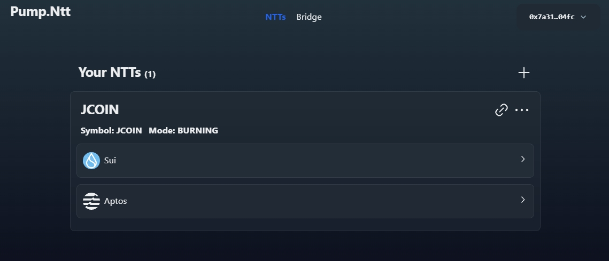
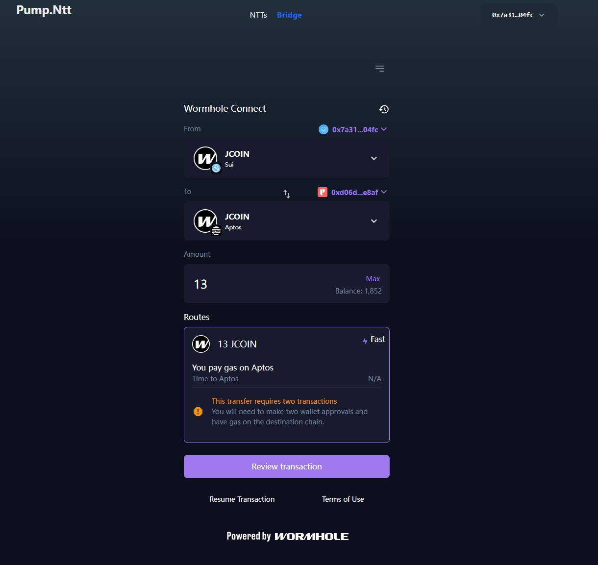
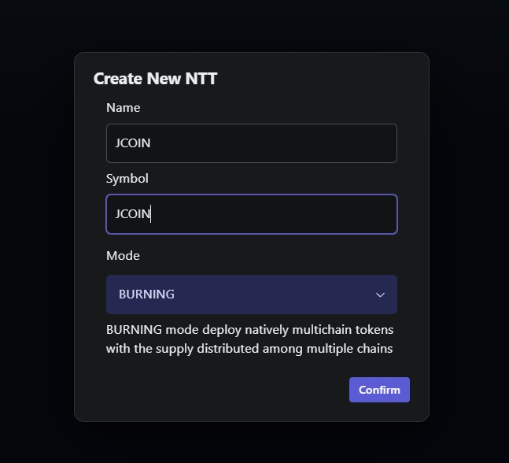
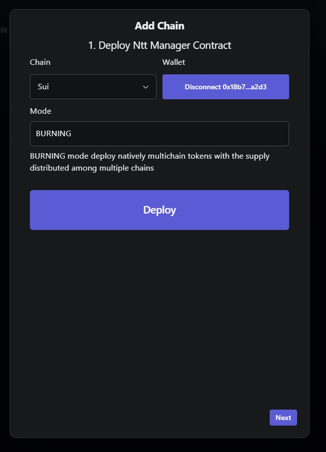
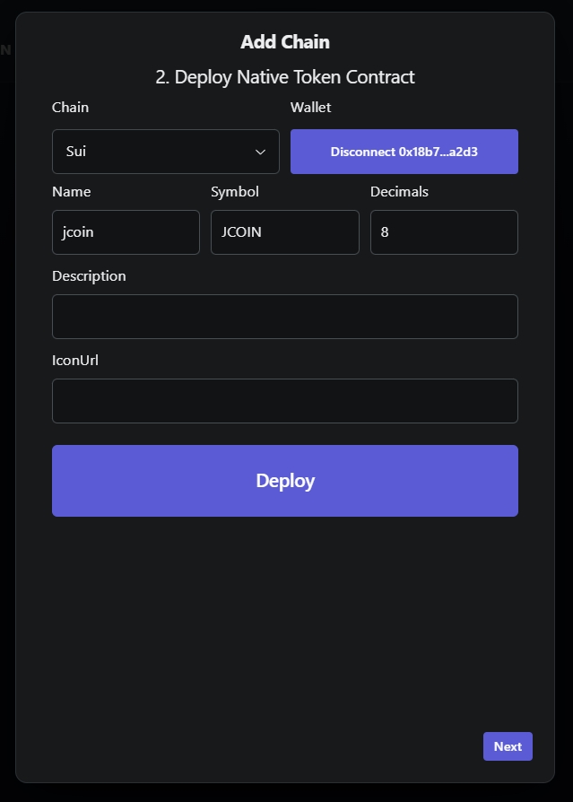
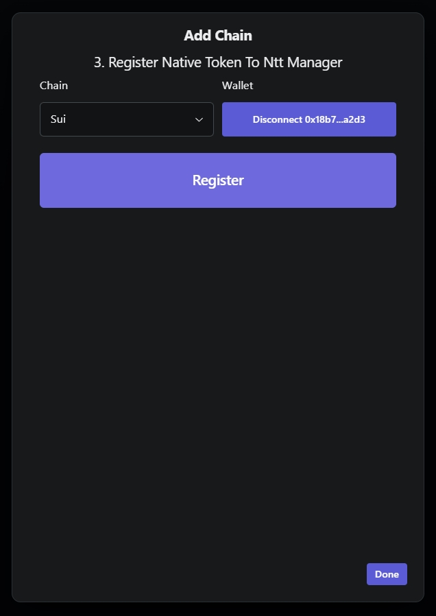
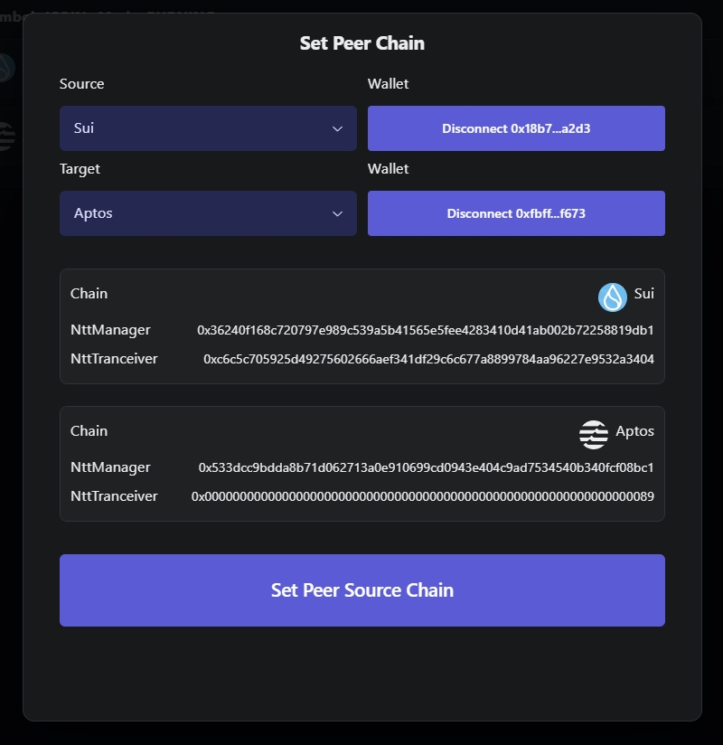
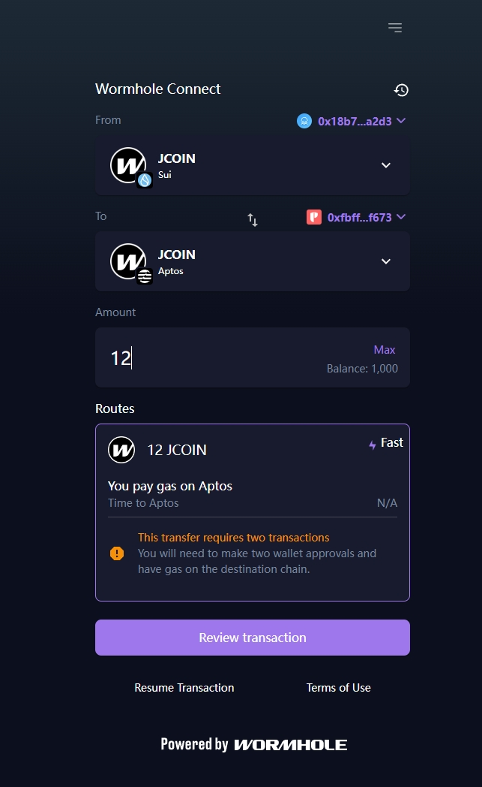

# pump.ntt

**pump.ntt** is a one-click dapp for easily deploying your own native token across blockchains powered by [Wormhole Ntt](https://wormhole.com/products/native-token-transfers)




After deploying, you can use bridge to transfer your native tokens accross blockchains

## Getting Started 

#### Installation

```bash
npm install
```

### Deploying Smart Contract
* PumpNtt

```bash
cd contracts/PumpNtt
sui client publish
```

* Ntt
https://github.com/fantasyni/wormhole-aptos-native-token-transfer/tree/ntt/starter

```bash
cd sui/contracts
sui client publish
```

```bash
cd aptos/contracts
aptos move create-object-and-publish-package --address-name wormhole_ntt
```

### Configuration

Configure src/constants.ts
* PumpNttPackageId
* PumpNttObjectType
* SuiNttPackageId
* AptosNttPackageId

### Start Dapp

```bash
npm run dev
```

### Dapp operations

#### Create Ntt

#### Add Chain



#### Set Peer Chain

#### Transfer Ntt 
